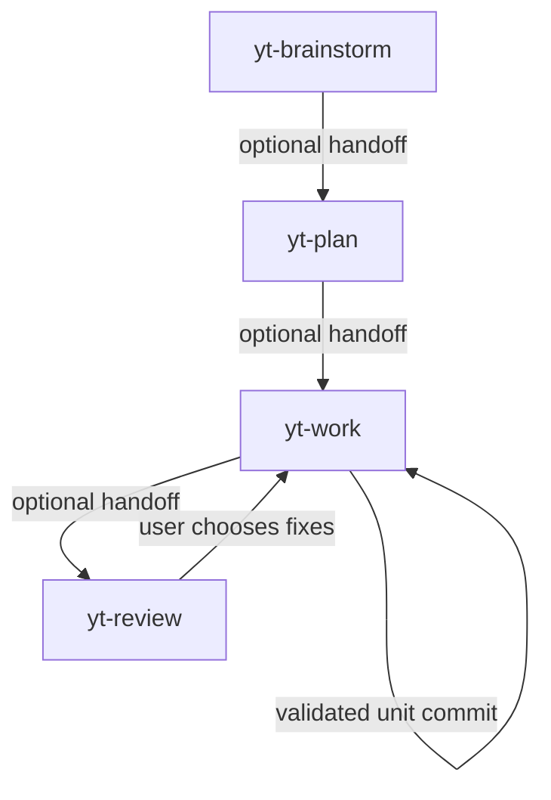
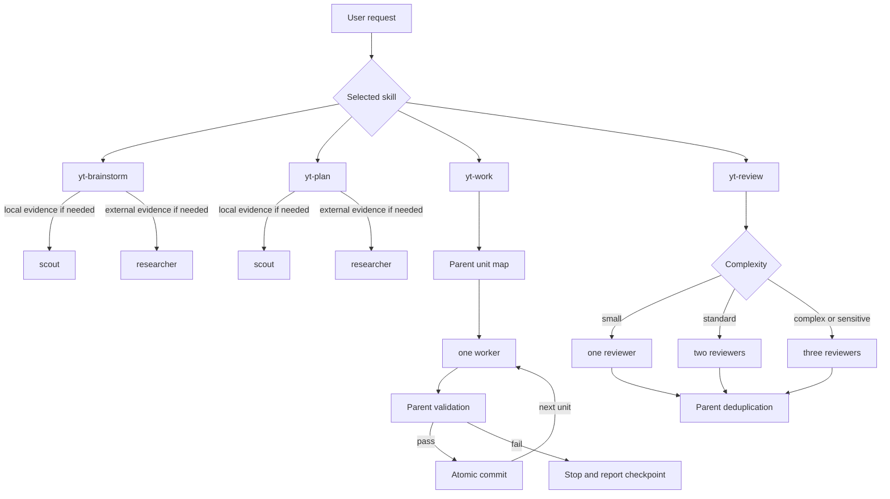

# Personal Pi Workflow - Plan

## Goal Capsule

- **Objective:** Ship a small public Pi-native workflow package that moves personal development from idea to reviewed commits without Compound Engineering's ceremony.
- **Authority:** Explicit user instructions override the Product Contract; the Product Contract overrides planning decisions; current Pi documentation and repository conventions resolve remaining implementation details.
- **Execution profile:** Pi-only, prompt-driven skills, bounded native subagents, sequential unit delivery, and one parent-created commit per validated unit.
- **Stop conditions:** Stop before guessing on product scope, committing unrelated changes, retrying a failed unit automatically, or mutating code during review.
- **Tail ownership:** Implementation includes local verification, atomic commits, public GitHub repository creation, and a clean Git-install smoke test; it excludes PR creation and CI setup.

---

## Product Contract

### Summary

Create `yteruel31/pi-workflow`, a public Pi package containing four independent skills: `yt-brainstorm`, `yt-plan`, `yt-work`, and `yt-review`.
The skills form a natural cycle while keeping PRDs and prior workflow stages optional.

### Problem Frame

The current Compound Engineering setup is capable but too complex for the intended personal workflow, particularly because it uses too many agents and repeated review or correction loops.
The replacement should retain useful structure, PRD continuity, targeted research, delegated implementation, and independent review without reproducing that orchestration overhead.

### Key Decisions

- **Use a dedicated native Pi package** (session-settled: user-approved — chosen over a bare Git bundle or adding the workflow to `pi-toolbox`: it keeps installation native and the workflow independently maintainable).
- **Use `yt-*` skill names** (session-settled: user-directed — chosen over `workflow-*`, `flow-*`, and `pi-workflow-*`: the personal prefix avoids global skill-name collisions).
- **Reuse Pi's native subagent roles** (session-settled: user-approved — chosen over maintaining Gigapay-style custom agents: fewer files and less orchestration provide the desired simplicity).
- **Keep PRDs optional** (session-settled: user-directed — chosen over strict or size-based requirements: no task should be blocked because a PRD does not exist).
- **Keep all four skills independent** (session-settled: user-approved — chosen over an enforced pipeline: each skill remains useful for direct personal requests).
- **Make review report-only** (session-settled: user-approved — chosen over automatic fixes or review-until-clean loops: the user retains control over whether findings return to `yt-work`).
- **Commit each validated work unit** (session-settled: user-directed — chosen over leaving commits to a later workflow: each unit should land as an atomic, parent-validated commit).

### Requirements

**Package and discovery**

- R1. The public repository installs through `pi install git:github.com/yteruel31/pi-workflow`.
- R2. The installed package exposes exactly four V1 skills: `yt-brainstorm`, `yt-plan`, `yt-work`, and `yt-review`.
- R3. Each skill follows Pi's Agent Skills-compatible `SKILL.md` structure and loads through Pi's native package discovery.

**Independent workflow behavior**

- R4. Each skill accepts a direct request without requiring another workflow stage to have run first.
- R5. Each skill may discover and reuse a relevant PRD or plan, but missing artifacts never block ordinary use.
- R6. `yt-brainstorm` clarifies product intent and may offer to create a concise PRD when preserving decisions would be useful.
- R7. `yt-plan` produces an implementation-ready plan from a PRD, an existing plan, or a direct request.
- R8. `yt-work` turns the approved request or plan into implementation units, delegates one unit at a time to a native `worker`, validates the result, and creates an atomic commit before starting the next unit.
- R9. `yt-review` reviews a diff, branch, PR, or working tree and returns one prioritized report without modifying code or remote state.
- R10. Successful completion of one skill suggests the next useful skill without starting it automatically.

**Bounded delegation**

- R11. The package ships no custom agent definitions and invokes only standard role names exposed by `pi-subagents`.
- R12. `yt-brainstorm` and `yt-plan` may each use at most one `scout` for local context and one `researcher` for external evidence when those roles materially improve the result.
- R13. `yt-work` uses one `worker` per unit in strict sequence; the parent does not write concurrently, validates each unit, and commits only unit-owned changes.
- R14. `yt-review` selects one, two, or three fresh `reviewer` perspectives according to change complexity, then deduplicates them into one report-only synthesis.
- R15. When `pi-subagents`, a requested role, or external research tooling is unavailable, the parent completes the responsibility inline when safe and discloses only the capability that was skipped.
- R16. No skill starts automatic retries, saved chains, background orchestration, review/fix loops, or agent-management operations.

### Key Flows

- F1. **Direct use:** The user invokes any `yt-*` skill with a request; the skill inspects available context, performs its single responsibility, and offers an optional handoff.
- F2. **Full cycle:** `yt-brainstorm` clarifies scope, `yt-plan` determines implementation, `yt-work` delegates and commits validated units, and `yt-review` produces the final report.
- F3. **Finding follow-up:** When `yt-review` reports actionable findings, the user may pass that report to `yt-work`; no automatic review/fix loop starts.
- F4. **Optional artifact:** The current request remains authoritative; user-specified artifacts provide supporting context, and auto-discovered artifacts are never modified or allowed to override the request silently.



### Success Criteria

- A real personal feature can move through brainstorm, plan, work, and review without mandatory documents or automatic review/fix loops.
- Each skill remains useful when invoked by itself.
- Every validated `yt-work` unit produces one atomic commit without absorbing pre-existing unrelated changes.
- Reviewer count scales from one to three according to meaningful complexity, and review never mutates the target.
- Installation and updates use Pi's native Git package flow.
- A reader can understand and modify each skill without learning a converter, marketplace, or custom-agent framework.

### Scope Boundaries

- No Claude Code, Codex, OpenCode, or other harness support.
- No custom marketplace, converter, installer CLI, prompt-command mirror, agent manifest, saved chain, or extension code.
- No mandatory PRD, Linear integration, worktree policy, separate commit skill, draft-PR workflow, retro workflow, or human-review workflow in V1.
- No automatic fixes in `yt-review` and no review-until-clean orchestration.
- No custom subagent definitions stored in the repository.
- No GitHub Actions or npm publication in V1.

### Dependencies / Assumptions

- Pi is the only supported runtime.
- `pi-subagents` is an optional capability enhancement, not an installation blocker; reduced inline behavior preserves direct skill use when it is absent.
- The native `researcher` role may require external web tooling; unavailable external evidence is reported rather than fabricated.
- Standard role names may resolve to user or project overrides because Pi agent discovery is configurable; the package guarantees its invocation contract, not a specific builtin implementation.
- The repository is public and uses the MIT license.

### Sources / Research

- Pi documents native skill directories, `SKILL.md` discovery, `/skill:<name>` commands, and package-provided skills in the [official Skills documentation](https://pi.dev/docs/latest/skills).
- Pi documents Git package installation and `pi.skills` manifests in the [official Packages documentation](https://pi.dev/docs/latest/packages).
- [`mitsuhiko/agent-stuff`](https://github.com/mitsuhiko/agent-stuff/blob/ab1e7f3414e4c8aa54a3eda0a3c634c32d3794f0/package.json#L17-L29) demonstrates a public Pi package exporting a conventional `skills/` directory.
- [`badlogic/pi-skills`](https://github.com/badlogic/pi-skills/blob/90bb51cae36515a648515b633a81c0c6efc8c74d/README.md#L1-L15) demonstrates the simpler self-contained skill-collection pattern.
- [`yteruel31/pi-toolbox`](https://github.com/yteruel31/pi-toolbox/blob/577c0cea750d2ee43f07844927bbea89afd261e2/package.json#L1-L24) confirms the user's existing Git-installed Pi package convention.
- [`gigapay/workflow`](https://github.com/gigapay/workflow/blob/2ac4e5ef5e3bef2f209eff5843df86122e2af6b6/README.md#L1-L50) shows that much of its installation complexity comes from supporting multiple harnesses and converter-backed targets.
- Gigapay's [`gig-review`](https://github.com/gigapay/workflow/blob/2ac4e5ef5e3bef2f209eff5843df86122e2af6b6/plugins/dev-workflow/skills/gig-review/SKILL.md#L11-L63) provides the report-only review behavior retained here without its mandatory custom-agent set.

---

## Planning Contract

### Product Contract Preservation

Changed: R8 and R11-R16, Key Decisions, Success Criteria, Scope Boundaries, and Dependencies — the user explicitly added targeted `researcher` use, sequential unit workers, parent-created commits, and adaptive one-to-three-reviewer fanout during planning.
All other Product Contract intent and stable IDs remain unchanged.

### Key Technical Decisions

- **Use Pi's package manifest directly.** Root `package.json` declares `pi.skills: ["./skills"]`; no installer, extension, runtime dependency, or conversion layer sits between Git installation and skill discovery. Implements the dedicated-package session-settled decision.
- **Keep each skill self-contained.** V1 behavior lives in four `SKILL.md` files with a consistent internal shape; shared helpers or references are added only if duplication becomes harder to maintain than four short files.
- **Use session-first artifacts.** Brainstorm and plan return complete output in chat by default; they create or update Markdown only after explicit user approval. The current request outranks discovered artifacts, and material conflicts trigger one focused question.
- **Bound research by evidence need.** `scout` answers repository questions and `researcher` answers external questions; each role runs at most once per brainstorm or plan invocation and only when the answer would change scope, approach, risk, or verification.
- **Deliver work through sequential workers** (session-settled: user-directed — chosen over parent-only implementation or parallel workers: one worker per unit preserves delegation while avoiding concurrent writes). The parent establishes a Git baseline, launches one worker, validates its diff and checks, stages only unit-owned changes, commits, then advances.
- **Keep commits parent-owned** (session-settled: user-approved — chosen over worker-created commits: the parent independently verifies unit scope before committing). A failed unit remains uncommitted and produces a checkpoint; no automatic retry or replacement worker starts.
- **Scale review from one to three perspectives** (session-settled: user-directed — chosen over a fixed reviewer count: review cost should follow meaningful complexity). One reviewer handles localized changes, two handle standard multi-concern changes, and three cover complex or sensitive changes with distinct correctness, requirements/tests, and risk/security prompts.
- **Make report-only review detectable.** Every reviewer task forbids edits and remote mutation; the parent compares Git state before and after review and reports a contract violation without reverting or launching a fixer.
- **Degrade inline instead of failing installation.** Missing subagent or web capabilities are disclosed and handled by the parent when safe, so `pi install git:github.com/yteruel31/pi-workflow` remains the only required package installation command.
- **Validate prompt contracts without dependencies.** Node's built-in test runner checks package inventory, frontmatter, role limits, independence, commit ownership, no-auto-handoff language, and report-only constraints; manual Pi scenarios cover behavior that static tests cannot prove.

### High-Level Technical Design



### Output Structure

```text
.
├── .gitignore
├── LICENSE
├── README.md
├── package.json
├── docs/
│   └── plans/
│       └── 2026-07-26-001-feat-personal-pi-workflow-plan.md
├── skills/
│   ├── yt-brainstorm/
│   │   └── SKILL.md
│   ├── yt-plan/
│   │   └── SKILL.md
│   ├── yt-review/
│   │   └── SKILL.md
│   └── yt-work/
│       └── SKILL.md
└── test/
    └── skills.test.js
```

### Implementation Constraints

- Skill frontmatter names match their directory names and use specific descriptions that state both capability and trigger.
- Handoffs name Pi's actual `/skill:yt-*` command form and never invoke the next skill automatically.
- Skills do not depend on Compound Engineering, custom task trackers, Linear, Proof, worktree helpers, or repository-specific agents.
- Child tasks are instructed not to spawn subagents; the parent skill owns all orchestration.
- `yt-work` requires a Git repository before implementation because successful unit completion requires a commit.
- Pre-existing unrelated changes remain unstaged and uncommitted; overlap with unit-owned files or hunks blocks the commit until the user resolves it.
- Native role shadowing by user or project configuration is outside the package's enforcement boundary and is documented as a trust assumption.

### Risks & Dependencies

| Risk or dependency | Mitigation |
|---|---|
| Prompt-contract tests cannot prove runtime model behavior. | Keep direct-use, missing-capability, sequential-commit, and report-only scenarios as release-blocking manual checks. |
| A configured `worker` or `reviewer` may differ from Pi's bundled role. | State the trust boundary, constrain every child task explicitly, and validate observable Git outcomes instead of claiming builtin identity. |
| A unit commit could absorb pre-existing user changes. | Capture the baseline, stage only unit-owned changes, inspect the staged diff, and stop on overlapping ownership. |
| A report-only reviewer may still have mutation-capable tools. | Forbid mutation in each task, compare Git state before and after, and report violations without automatic repair. |
| Remote publication depends on GitHub authentication and repository-name availability. | Keep publication in the final unit and stop before remote mutation when ownership, visibility, or authentication cannot be verified. |
| External research depends on an available `researcher` role and web tooling. | Continue with local evidence, label the gap, and never fabricate current external guidance. |

### Sequencing

U1 establishes package metadata before skill discovery work.
U2, U3, and U4 add the four prompt contracts and extend the same test suite.
U5 finalizes public documentation and local package validation after all skills exist.
U6 publishes only after every local gate passes.

---

## Implementation Units

### U1. Establish the Pi package foundation

- **Goal:** Create the minimal public package metadata and repository scaffolding that Pi can load directly from Git.
- **Requirements:** R1-R3; dedicated native Pi package Key Decision.
- **Dependencies:** None.
- **Files:** `package.json`, `.gitignore`, `LICENSE`, `README.md`, `docs/plans/2026-07-26-001-feat-personal-pi-workflow-plan.md`.
- **Approach:** Declare package identity, repository metadata, MIT license, `pi-package`/`pi-skill` keywords, `pi.skills: ["./skills"]`, and a dependency-free `npm test` script. Initialize Git locally without publishing yet, and include the existing plan artifact in the foundation commit. Keep the README skeletal until usage behavior is implemented.
- **Patterns to follow:** Root metadata and install wording from `pi-toolbox`; native `pi.skills` export from `mitsuhiko/agent-stuff`.
- **Test scenarios:** Test expectation: none — this unit is package scaffolding; its verification is manifest parsing and package metadata inspection.
- **Verification:** The manifest parses, exports only `./skills`, declares no runtime dependencies, and the repository has a clean initial foundation commit created by the parent after validation.

### U2. Add independent brainstorm and planning skills

- **Goal:** Implement product discovery and technical planning without mandatory artifacts or systematic delegation.
- **Requirements:** R4-R7, R10-R12, R15-R16, F1, F2, F4; session-first artifacts and bounded research KTDs.
- **Dependencies:** U1.
- **Files:** `skills/yt-brainstorm/SKILL.md`, `skills/yt-plan/SKILL.md`, `test/skills.test.js`.
- **Approach:** Give both skills direct-entry input handling, explicit-artifact precedence, focused context discovery, one-question-at-a-time blocking decisions, concise output contracts, and optional handoffs. Allow at most one `scout` and one `researcher` when their distinct evidence would change the result; otherwise work inline. Offer artifact creation only after useful decisions exist and only with user approval.
- **Patterns to follow:** Self-contained Agent Skills frontmatter from `badlogic/pi-skills`; product-only versus planning-only separation from Gigapay without Linear, mandatory PRDs, worktrees, or custom reviewers.
- **Test scenarios:**
  - Invoke each skill from a direct request with no PRD or plan; it completes its responsibility without rejecting the input.
  - Provide one explicit artifact and one conflicting auto-discovered artifact; the explicit request and supplied artifact win, and neither file is silently modified.
  - Use a repository-only question; at most one `scout` runs and no `researcher` runs.
  - Use a current external-practice question; at most one `researcher` runs and unavailable web tooling becomes a disclosed evidence gap.
  - Complete either skill; it suggests `/skill:yt-plan` or `/skill:yt-work` without starting it.
- **Verification:** Static tests confirm frontmatter, direct-entry language, optional-artifact policy, role limits, graceful fallback, and non-executing handoffs; manual scenarios produce concise brainstorm and implementation-plan outputs.

### U3. Add sequential worker orchestration and atomic commits

- **Goal:** Implement approved work through one native worker per unit while the parent validates and commits each unit safely.
- **Requirements:** R4-R5, R8, R10-R13, R15-R16, F1-F2; sequential-worker and parent-owned-commit KTDs.
- **Dependencies:** U1, U2 when consuming a `yt-plan` artifact.
- **Files:** `skills/yt-work/SKILL.md`, `test/skills.test.js`.
- **Approach:** Resolve an explicit plan when present or derive a lightweight unit map from a direct request. Snapshot Git status and pre-existing changes, then launch exactly one `worker` for the current unit. The worker edits and runs focused checks but does not commit or spawn children. The parent inspects unit scope, reruns decisive checks, stages only unit-owned changes, verifies the staged diff, and commits before advancing. A failed or ambiguous unit remains uncommitted and stops with a checkpoint rather than an automatic retry.
- **Patterns to follow:** Pi's single-writer subagent safety and Gigapay's unit mapping/surgical-change discipline, simplified to one sequential writer and no review loop.
- **Test scenarios:**
  - Run from a direct implementation request with no plan; the parent creates a small unit map and starts the first worker.
  - Run a two-unit plan; workers never overlap, and the second starts only after the first parent-created commit exists.
  - Seed unrelated staged and unstaged changes; no unit commit contains them.
  - Make a unit touch a file with overlapping pre-existing edits; validation stops before staging or committing and asks for user resolution.
  - Make worker verification fail; the parent creates no commit, launches no replacement, and reports changed files, checks, failure, and next user-controlled action.
  - Disable `pi-subagents`; the parent performs the unit inline, still validates and commits it, and reports that worker delegation was unavailable.
- **Verification:** Static tests assert sequential `worker` use, child no-commit/no-subagent rules, parent validation, staged-diff inspection, atomic commit requirement, foreign-change protection, and no automatic retry; a fixture repository proves one clean commit per passing unit.

### U4. Add adaptive report-only review

- **Goal:** Produce one prioritized review report using one to three native reviewers without mutating the reviewed target.
- **Requirements:** R4-R5, R9-R11, R14-R16, F1, F3-F4; adaptive-review and report-only KTDs.
- **Dependencies:** U1.
- **Files:** `skills/yt-review/SKILL.md`, `test/skills.test.js`.
- **Approach:** Resolve explicit diff/PR/branch targets before the current working tree, determine and report the comparison base, and include staged, unstaged, and relevant untracked changes for working-tree review. Classify complexity semantically: localized change uses one reviewer; multi-concern or cross-module work uses two; complex or sensitive work uses three distinct correctness, requirements/tests, and risk/security perspectives. Run fresh review-only children, synthesize and deduplicate P0-P3 findings once, and never fix or hand off automatically.
- **Patterns to follow:** Gigapay's target-resolution, untrusted-input, severity, and report-only patterns; replace its fixed custom-agent set with adaptive native `reviewer` prompts.
- **Test scenarios:**
  - Review a localized one-file change; exactly one reviewer runs.
  - Review a standard cross-module change; two reviewers run with non-duplicated angles.
  - Review security-, authorization-, migration-, concurrency-, or public-API-sensitive work; three reviewers run with distinct prompts.
  - Review an explicit patch, a dirty working tree, a branch, and a PR; each report names target, base, coverage, and confidence.
  - Supply an inaccessible PR or indeterminate branch base; the skill asks one focused question rather than guessing.
  - Seed actionable findings; the skill returns after one synthesis and only suggests `/skill:yt-work`.
  - Compare Git state before and after normal review; files, index, HEAD, refs, and remotes remain unchanged.
  - Disable reviewer roles; the parent performs a labeled single-session review with reduced confidence.
- **Verification:** Static tests assert the one-to-three adaptive policy, fresh review-only prompts, no-mutation/no-fix rules, one synthesis, target precedence, and optional handoff; manual fixture reviews confirm unchanged Git state.

### U5. Finalize package documentation and local validation

- **Goal:** Make the public repository understandable, installable, and maintainable without adding workflow infrastructure.
- **Requirements:** R1-R3, R10-R16; all Success Criteria except remote installation.
- **Dependencies:** U2-U4.
- **Files:** `README.md`, `package.json`, `test/skills.test.js`.
- **Approach:** Document the four skills, natural-language and `/skill:yt-*` invocation, Git installation, updates, pinning, optional `pi-subagents` enrichment, graceful fallback, role matrix, commit-per-unit behavior, report-only guarantee, and trust boundary for configured role overrides. Keep tests dependency-free and focused on durable prompt contracts rather than exact prose.
- **Patterns to follow:** Concise installation/update sections from `pi-toolbox`; inventory and prompt-contract tests from Gigapay's dependency-free `node:test` suite.
- **Test scenarios:**
  - Parse the package and discover exactly the four expected `SKILL.md` files with matching frontmatter names and non-empty descriptions.
  - Assert no `agents/`, `commands/`, `extensions/`, chains, marketplace manifests, runtime dependencies, or extra discovered skills ship.
  - Pack the repository and inspect the archive; only intended public files are included.
  - Load the local package in Pi; all four skills are discoverable and their command names match the README.
- **Verification:** `npm test` passes, `npm pack --dry-run` contains the intended files, local Pi package loading discovers exactly four skills, and the parent creates the final local validation commit.

### U6. Publish and smoke-test the Git installation

- **Goal:** Create the public GitHub repository and prove the documented installation path from a clean Pi environment.
- **Requirements:** R1-R3; installation Success Criteria.
- **Dependencies:** U5.
- **Files:** No source files expected; documentation changes are allowed only if the smoke test exposes incorrect instructions.
- **Approach:** Confirm GitHub authentication and public visibility, create `yteruel31/pi-workflow`, push the validated commit history, install through the exact Git source, restart Pi, and verify discovery and direct invocation. Do not add npm publication, CI, release automation, or a PR flow.
- **Execution note:** Treat remote repository creation and push as the final externally visible action; stop and report if authentication, ownership, or public visibility cannot be verified.
- **Patterns to follow:** The existing `pi-toolbox` Git install convention.
- **Test scenarios:**
  - Install `git:github.com/yteruel31/pi-workflow` in a clean Pi setup; the package resolves without additional mandatory package installation.
  - Confirm exactly `yt-brainstorm`, `yt-plan`, `yt-work`, and `yt-review` are added by this package.
  - Invoke each skill directly without project artifacts; each begins its own responsibility.
  - Run with `pi-subagents` unavailable; each skill follows its documented inline fallback.
  - Pin the Git source to the initial commit or tag and confirm Pi resolves the pinned version.
- **Verification:** The repository is publicly reachable, the exact install command succeeds, the four skills are discoverable, and no uncommitted source changes remain after the smoke-test result is documented.

---

## Verification Contract

| Gate | Applies to | Required outcome |
|---|---|---|
| `npm test` | U2-U5 | Package inventory, frontmatter, independence, delegation limits, commit ownership, and report-only contracts pass without third-party dependencies. |
| `npm pack --dry-run` | U5 | The package archive contains only intended source, documentation, license, tests, and plan files. |
| Local Pi package load | U4-U5 | Pi discovers exactly four skills with the expected `yt-*` names before remote publication. |
| Fixture Git workflow | U3 | Sequential workers produce one parent-validated atomic commit per passing unit and exclude unrelated changes. |
| Fixture review matrix | U4 | Reviewer count follows complexity, one deduplicated report returns, and repository/remote state is unchanged. |
| `pi install git:github.com/yteruel31/pi-workflow` | U6 | A clean Pi setup installs the public package and discovers all four skills. |
| Direct-use scenarios | U2-U6 | Every skill works without a PRD or previous stage and never auto-starts its handoff. |
| Missing-capability scenarios | U2-U6 | Safe inline fallback works and accurately reports skipped delegation or external evidence. |

Prompt-contract tests prove structure, not model compliance.
Manual scenarios therefore remain release-blocking for direct use, sequential commits, adaptive review, and graceful fallback.

---

## Definition of Done

### Global

- The public repository installs with `pi install git:github.com/yteruel31/pi-workflow`.
- Pi discovers exactly the four `yt-*` skills declared by the Product Contract.
- Each skill handles direct input without mandatory PRDs or previous workflow stages.
- Delegation follows the confirmed role matrix and never enters an automatic retry or review/fix loop.
- `yt-work` creates one parent-validated atomic commit per completed unit and never commits unrelated changes.
- `yt-review` uses one to three reviewers according to complexity and leaves local and remote state unchanged.
- Static tests, package inspection, local loading, fixture scenarios, and remote installation checks pass.
- README installation, invocation, fallback, commit, and review behavior matches the shipped skills.
- No converter, marketplace, custom agent, CI, npm publication, or unrelated workflow surface is added.
- Abandoned experiments, temporary package archives, fixture repositories, and dead prompt variants are removed.

### Per Unit

- U1. Native package metadata, license, Git foundation, and initial parent-created commit are complete.
- U2. Brainstorm and plan work directly, research only when material, and write artifacts only with approval.
- U3. Sequential workers, parent validation, foreign-change protection, and commit-per-unit behavior pass fixture verification.
- U4. Adaptive reviewer selection, target resolution, deduplication, and report-only invariants pass fixture verification.
- U5. Documentation, contract tests, package contents, and local Pi discovery agree.
- U6. The public Git source installs cleanly and exposes the expected four skills.
